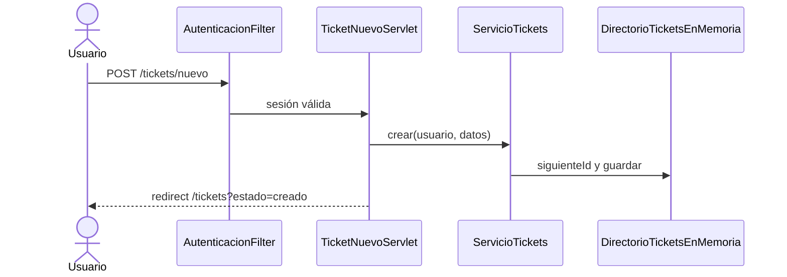

# ServiceDesk 360 — Sistema de Gestión de Soporte Técnico

> **Caso Modelo Enterprise:** Plataforma web centralizada para la administración de incidentes, mesa de ayuda, inventario de activos y trazabilidad de niveles de servicio (SLA).

[](https://www.oracle.com/java/)
[](https://jakarta.ee/)
[](https://tomcat.apache.org/)
[](https://maven.apache.org/)
[](#)

---

## Descripción del Proyecto

**ServiceDesk 360** es un sistema dinámico desarrollado sobre arquitectura Java Web (JSP/Servlets) diseñado para la empresa *TecnoSoporte Centroamérica*. Su objetivo es reemplazar la gestión informal de incidencias (mensajes de texto y hojas de cálculo) por una plataforma web corporativa con roles definidos (Solicitante, Técnico, Administrador) y trazabilidad completa de cada ticket de soporte.

---

## Stack Tecnológico (Sprint Inicial / Semana 1)

| Tecnología | Versión / Componente | Descripción |
| :--- | :--- | :--- |
| **Lenguaje** | OpenJDK 11+ | Entorno de ejecución y compilación de la lógica de negocio. |
| **Vista & Control** | JSP 2.3 / Servlets 4.0 | Maquetación dinámica con JSTL y manejo de peticiones HTTP. |
| **Servidor de Apps** | Apache Tomcat 9.x | Servidor de contenedores de servlets y páginas web. |
| **Entorno IDE** | Apache NetBeans 12+ / 17+ | Entorno integrado de desarrollo y depuración. |
| **Gestor de Builds** | Apache Maven 3.x | Control de dependencias (`pom.xml`) y ciclo de vida de compilación (`.war`). |
| **Estilos** | CSS3 / Bootstrap 5 | Diseño responsivo e identidad visual corporativa. |

---

## Requisitos del Entorno de Desarrollo

Antes de desplegar la aplicación, asegúrese de contar con las siguientes herramientas configuradas en su equipo:

1. **JDK (Java Development Kit) 11** o superior instalado y configurado en la variable de entorno `JAVA_HOME`.
2. **Apache Tomcat 9.0.x** registrado correctamente dentro del panel de servidores de su IDE (*Services > Servers* en NetBeans).
3. **Disponibilidad de puertos:** Asegurarse de que el puerto por defecto (`8080`) no esté ocupado por otros servicios (IIS, Oracle XE, Docker).

---

## Guía de Instalación y Ejecución

Siga estos pasos para compilar y desplegar el proyecto localmente:

### 1. Clonar o Importar el Proyecto
* Clonar este repositorio o abrir la carpeta raíz directamente desde Apache NetBeans:
  `File` &rarr; `Open Project` &rarr; Seleccionar **servicedesk360**.

### 2. Limpieza y Compilación con Maven
* Haga clic derecho sobre el nombre del proyecto en el explorador de proyectos.
* Seleccione **Clean and Build** (o ejecute en terminal: `mvn clean package`).
* Verifique que Maven descargue las dependencias y genere el empaquetado `.war` sin errores.

### 3. Despliegue en Servidor
* Haga clic derecho sobre el proyecto y seleccione **Run** (o presione `F6`).
* Seleccione **Apache Tomcat 9.0** como el servidor objetivo si el IDE se lo solicita.

### 4. Verificación en Navegador
Una vez iniciado el servidor, ingrese a las siguientes rutas en su navegador preferido:

* **Portal Principal:** `http://localhost:8080/servicedesk360/`
* **Módulo de Acceso:** `http://localhost:8080/servicedesk360/acceso`
* **Registro de Usuario:** `http://localhost:8080/servicedesk360/registro`
* **Servlet de Diagnóstico:** `http://localhost:8080/servicedesk360/diagnostico`

---

## Estructura General del Proyecto

```text
servicedesk360/
├── src/
│   └── main/
│       ├── java/
│       │   └── sv/edu/itca/servicedesk/
│       │       ├── controller/        # Servlets (Acceso, Registro, Diagnostico)
│       │       └── model/             # Clases POJO y Beans de Dominio
│       └── webapp/
│           ├── META-INF/
│           ├── WEB-INF/
│           │   └── web.xml            # Descriptor de despliegue
│           ├── resources/
│           │   ├── css/               # Hojas de estilo globales (estilos.css)
│           │   └── js/                # Scripts del cliente
│           ├── index.jsp              # Página de bienvenida
│           ├── acceso.jsp             # Formulario de login
│           ├── registro.jsp           # Formulario de alta de usuario
│           └── panel.jsp              # Dashboard del sistema
└── pom.xml                            # Configuración de dependencias Maven
```

## Guía 4: MVC con Servlets

El flujo principal usa Servlets como controladores, servicios para las reglas del
caso de uso y vistas JSP internas en `WEB-INF/views`.

### Rutas

| Ruta | Método | Controlador | Protección | Resultado |
| --- | --- | --- | --- | --- |
| `/acceso` | GET/POST | `AccesoServlet` | No | Login y redirect a `/panel` |
| `/registro` | GET/POST | `RegistroServlet` | No | Alta mediante `ServicioRegistro` |
| `/panel` | GET | `PanelServlet` | Sí | Vista interna del panel |
| `/tickets` | GET | `TicketListadoServlet` | Sí | Listado mediante `ServicioTickets` |
| `/tickets/nuevo` | GET/POST | `TicketNuevoServlet` | Sí | Formulario o redirect PRG |
| `/cerrar-sesion` | POST | `CerrarSesionServlet` | Sí | Invalida sesión y redirige a acceso |

`AutenticacionFilter` comprueba `usuarioAutenticado` en la sesión. Los contratos
`BuscadorTickets` y `RegistradorTickets` permiten sustituir el almacenamiento en
memoria por JDBC/MySQL en la siguiente guía. Los POST exitosos aplican
Post/Redirect/Get; los errores usan `forward` y conservan los datos del formulario.

### Diagrama de secuencia



### Pruebas documentadas

Se deben verificar: compilación Maven, acceso anónimo bloqueado, GET del formulario,
validación de título/descripción/prioridad, creación válida, PRG sin duplicados,
escape de texto mediante `c:out`, cierre de sesión y pérdida esperada de tickets al
reiniciar Tomcat. El detalle de la bitácora está en `docs/bitacora_guia4.md`.
